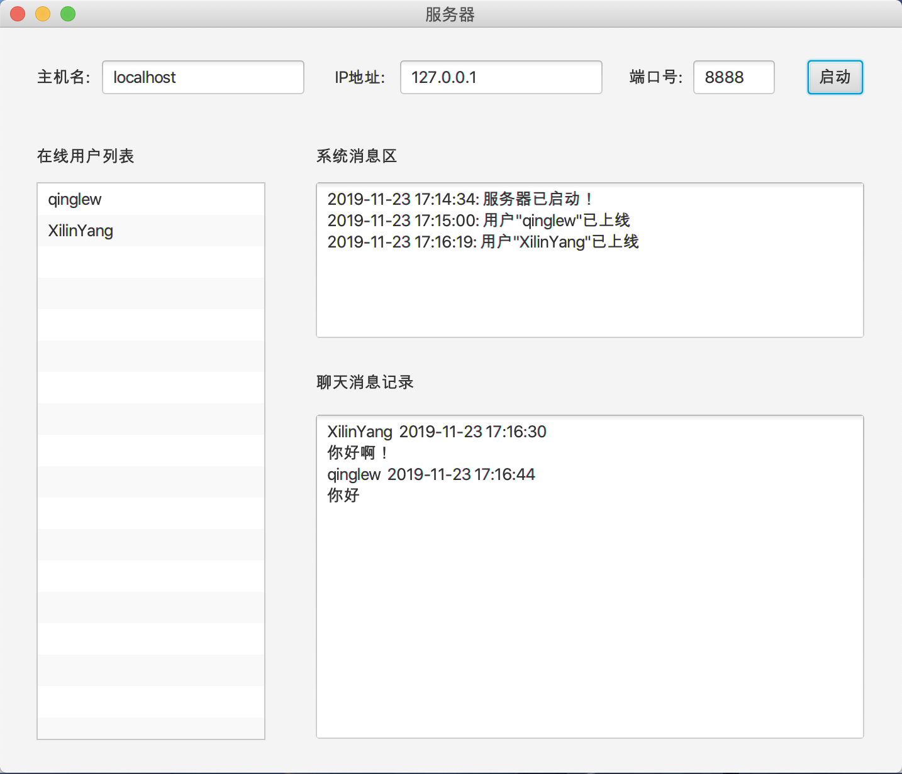
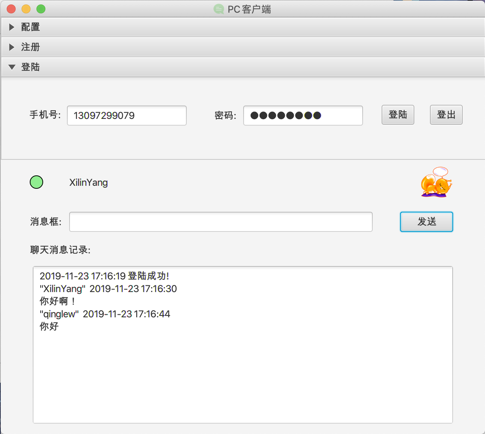

# OnlineChatter

### Introduction

This is the server and PC client with GUI of the online chatter, which is the the final exam of the course Android Application Development of NCU in autumn term in 2019-2020. As for the Android client, please click [here](https://github.com/qinglew/OnlineChatting).

### Technology Stack

* Maven
* Java
* JavaFx
* TCP/IP (Socket)
* MyBatis
* MySQL
* Junit

### ScreenShots

**Server**

**PC Client**

